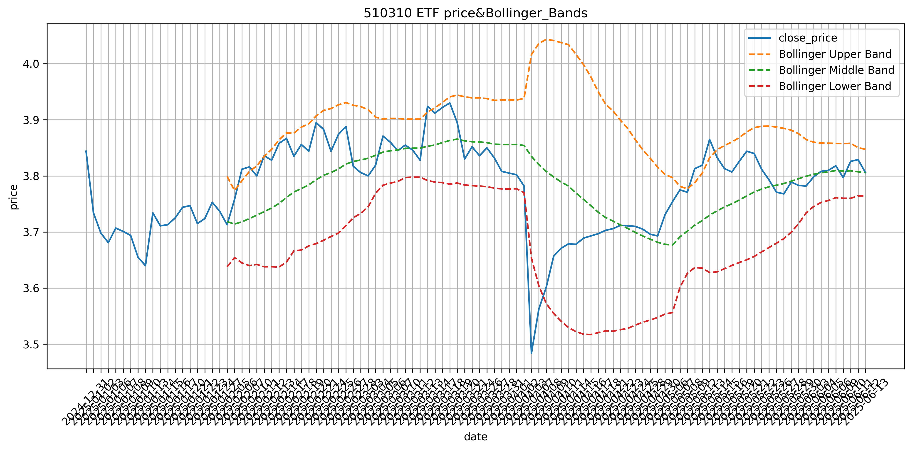

# **构建ETF (510310) 量化交易：实战01**

### 引言

量化交易，凭借其系统化、纪律性的特点，在中国A股市场中吸引了越来越多的关注。然而，构建一个稳定盈利的量化交易系统并非易事，它融合了金融知识、数据分析、编程技术和严格的风险控制。本文旨在为有志于对A股ETF（沪深300 ETF，代码510310）进行量化交易的实践者提供一份详尽的指南。我们将探讨如何选择合适的工具框架，如何高效获取和处理市场数据，如何选择并训练预测模型（例如长短期记忆网络LSTM），以及如何使用Python语言将这一切整合为一个完整的交易策略，并进行回测与评估。本文将循序渐进，引领了解构建个性化量化交易系统的核心环节与技术细节。


### A股量化交易系统基础

首先需要明确构建量化交易系统的核心目标与基本流程。

* **目标设定**: 核心目标是指导构建一个针对特定A股ETF（如510310）的、由数据驱动的个性化量化交易系统。这不仅仅是编写代码，更是一个涉及策略构思、数据验证、模型迭代和风险管理的系统工程。  

* **算法交易工作流程**: 一个典型的量化交易系统开发生命周期包括以下关键阶段：  
  * **策略构思与制定**: 例如，基于早盘（如9:30-11:30）数据预测日内后续走势。  
  * **数据获取与预处理**: 对中国市场而言，高质量、准确的数据是成功的基石。  
  * **特征工程**: 将原始市场数据转换为对模型具有预测能力的输入特征。  
  * **模型选择与训练**: 挑选合适的机器学习或深度学习模型作为预测引擎，并使用历史数据进行训练。  
  * **回测与绩效评估**: 在历史数据上严格测试策略的表现，评估其盈利能力和风险水平。  
  * **优化**: 调整策略参数以期改善表现，但需警惕过度拟合历史数据。  
  * **风险管理**: 设定止损、仓位控制等规则，是任何交易系统不可或缺的部分。  
  * **执行与实盘交易**: 将策略部署到真实市场进行交易，这是最终目标，也伴随着新的挑战。

构建量化交易系统并非一个一蹴而就的线性过程。在实际操作中，回测阶段的发现往往会促使开发者重新审视数据预处理方法、特征工程的有效性，甚至可能需要调整最初的策略构想。

此外，A股市场具有其独特性，例如特定的交易时间（包括早盘和午盘）、T+1交易制度、市场参与者结构（散户占比较高）以及独特的监管环境。这些因素都可能影响策略的表现和数据的可获得性。虽然通用的量化交易原则适用，但针对A股市场的具体情况调整策略设计、数据源选择和特征工程方法至关重要。例如，在特征工程中考虑A股特有的市场情绪指标等，都是必要的考量。

### 思路

使用 **Akshare进行数据获取**
使用 **Backtrader进行策略开发、机器学习模型集成和回测**。  
>Akshare专注于市场数据的便捷访问，而Backtrader则提供了强大且通用的回测功能。

##### 日线数据
```python
import akshare as ak
# 获取510310从20241231至今的日线数据
etf_daily_data_df = ak.fund_etf_hist_em(
    symbol="510310",
    period="daily",
    start_date="20241231",
    end_date="20250613",
    # 复权选项，"qfq" 表示前复权。
    adjust="qfq",
)
print(etf_daily_data_df.head())
```

```text
   日期        开盘    收盘   最高   最低    成交量   成交额         振幅  涨跌幅 涨跌额  换手率
0  2024-12-31  3.908  3.844  3.914  3.840  6333588  2.468697e+09  1.90 -1.56 -0.061  0.92
1  2025-01-02  3.843  3.734  3.847  3.711  5904672  2.241905e+09  3.54 -2.86 -0.110  0.86
2  2025-01-03  3.733  3.698  3.749  3.683  4671549  1.743487e+09  1.77 -0.96 -0.036  0.68
3  2025-01-06  3.691  3.681  3.703  3.655  3677486  1.360281e+09  1.30 -0.46 -0.017  0.53
4  2025-01-07  3.680  3.707  3.709  3.669  2064402  7.656138e+08  1.09  0.71  0.026  0.30
```

##### 分钟线数据
```python
minute_data_df = ak.stock_zh_a_hist_min_em(
    symbol="000001",
    period="1",
    start_date="2025-06-11 09:30:00",
    end_date="2025-06-11 15:00:00",
    adjust="qfq",
)
print(minute_data_df.head())
```

```text
   时间       开盘     收盘     最高     最低    成交量         成交额      均价
0  2025-06-11 09:30:00  0.0  11.82  11.82  11.82   4809   5684238.0  11.820
1  2025-06-11 09:31:00  0.0  11.83  11.84  11.79  14434  17056953.0  11.818
2  2025-06-11 09:32:00  0.0  11.83  11.84  11.82   5445   6440638.0  11.820
3  2025-06-11 09:33:00  0.0  11.82  11.83  11.81  11489  13577027.0  11.819
4  2025-06-11 09:34:00  0.0  11.84  11.84  11.82   8117   9603481.0  11.822
```
- 复权说明
>复权是指在股票或ETF等金融资产的价格数据中，调整历史价格以消除因分红、配股、拆股等事件导致的价格跳跃，使数据更具连续性和可比性。复权主要分为以下几种类型：
>1. **前复权 (qfq)**：以当前价格为基准，调整历史价格，使历史数据与当前价格水平保持一致。适用于分析长期趋势，观察价格的实际走势
>2. **后复权 (hfq)**：以最早的价格为基准，调整后续价格，反映包含分红等收益的真实投资回报。适合评估长期持有收益
>3. **不复权 ('')**：使用原始价格数据，包含因分红、拆股等导致的价格跳跃，适合短期分析或观察实际交易价格
- 字段中英对照
```python
column_mapping = {
    "日期": "date",
    "开盘": "open",
    "收盘": "close",
    "最高": "high",
    "最低": "low",
    "成交量": "volume",
    "成交额": "amount",
    "振幅": "amplitude",
    "涨跌幅": "change_pct",
    "涨跌额": "change",
    "换手率": "turnover",
}
```

### 特征工程

* **特征工程：从原始数据中创造预测性输入**  
  * **基本原理**: 原始的价格数据往往不直接具备良好的预测性。技术指标和其他工程化的特征能够捕捉市场潜在的模式或状态 
  * **常用技术指标示例**:  
    * 移动平均线 (SMA, EMA): 识别趋势
    * 相对强弱指数 (RSI): 判断超买/超卖状态  
    * 布林带 (Bollinger Bands): 衡量波动性及相对价格水平 
    * 平滑异同移动平均线 (MACD)  
    * 能量潮 (OBV)
  * **引入滞后特征**: 使用过去的价格或指标值作为当前特征 (例如, Closet−1​, RSIt−1​) 
  * **波动性度量**: 例如，平均真实波幅 (ATR) 或收益率的标准差

>虽然创建大量特征在理论上可能捕捉更多信息，但过多的特征（尤其是在数据量有限的情况下）容易导致模型过度拟合，使其在未见过的数据上表现糟糕。复杂的特征也可能使模型难以理解和调试。通常，精心挑选的、具有经济学意义且易于理解的特征组合，往往比盲目堆砌特征更为有效。

* **使用 ta**: 这是一个便捷的Python库，用于计算各种技术指标

| 指标名称 | 简要描述 | 交易中典型用途 | 
| :---- | :---- | :---- | 
| SMA (简单移动平均) | 一段时间内收盘价的算术平均值 | 识别短期、中期、长期趋势 |
| EMA (指数移动平均) | 加权移动平均，近期价格权重更大 | 趋势跟踪，比SMA更敏感 | 
| RSI (相对强弱指数) | 衡量近期价格变化的幅度，判断超买超卖 | 识别潜在反转点，衡量市场动能 | 
| Bollinger Bands | 由移动平均线及上下两条标准差带构成 | 判断价格相对高低，衡量市场波动性 |
| MACD (平滑异同移动平均) | 两条指数移动平均线之差及其信号线 | 趋势识别，金叉死叉信号 | 
| OBV (能量潮) | 累计成交量，将成交量变化与价格方向联系起来 | 判断资金流入流出，验证趋势强度 | 

```python
import akshare as ak
import pandas as pd
import numpy as np
from ta.utils import dropna
from ta.volatility import BollingerBands
from ta.trend import SMAIndicator, MACD
from ta.momentum import RSIIndicator
from ta.volume import OnBalanceVolumeIndicator
import matplotlib.pyplot as plt

# 获取510310从2024-12-31至今的日线数据
etf_daily_data_df = ak.fund_etf_hist_em(
    symbol="510310",
    period="daily",
    start_date="20241231",
    end_date="20250613",
    adjust="qfq",
)

# 检查原始数据
print("原始数据前5行：")
print(etf_daily_data_df.head())

# 重命名列以匹配 ta 库要求
column_mapping = {
    "日期": "date",
    "开盘": "open",
    "收盘": "close",
    "最高": "high",
    "最低": "low",
    "成交量": "volume",
    "成交额": "amount",
    "振幅": "amplitude",
    "涨跌幅": "change_pct",
    "涨跌额": "change",
    "换手率": "turnover",
}
df = etf_daily_data_df.rename(columns=column_mapping)

# 确保数据类型正确
for col in ["open", "close", "high", "low", "volume"]:
    df[col] = df[col].astype(float)

# 清理数据（去除 NaN）
df = dropna(df)
print("\n清洗后数据形状：", df.shape)

# 验证 close 列数据
print("\n检查 close 列：")
print(f"close 列数据类型：{df['close'].dtype}")
print(f"close 列是否有 NaN：{df['close'].isna().any()}")

# 创建 DataFrame 副本以避免碎片化
df = df.copy()

# 批量计算技术指标
indicators = {
    "bb_mavg": BollingerBands(
        close=df["close"], window=20, window_dev=2
    ).bollinger_mavg(),
    "bb_hband": BollingerBands(
        close=df["close"], window=20, window_dev=2
    ).bollinger_hband(),
    "bb_lband": BollingerBands(
        close=df["close"], window=20, window_dev=2
    ).bollinger_lband(),
    "sma_10": SMAIndicator(close=df["close"], window=10).sma_indicator(),
    "rsi_14": RSIIndicator(close=df["close"], window=14).rsi(),
    "macd": MACD(
        close=df["close"], window_fast=12, window_slow=26, window_sign=9
    ).macd(),
    "macd_signal": MACD(
        close=df["close"], window_fast=12, window_slow=26, window_sign=9
    ).macd_signal(),
    "obv": OnBalanceVolumeIndicator(
        close=df["close"], volume=df["volume"]
    ).on_balance_volume(),
}

# 使用 pd.concat 一次性添加所有指标
df = pd.concat([df, pd.DataFrame(indicators, index=df.index)], axis=1)

# 计算滞后特征和波动性
df["close_t-1"] = df["close"].shift(1)
df["rsi_t-1"] = df["rsi_14"].shift(1)
df["returns"] = df["close"].pct_change()
df["volatility"] = df["returns"].rolling(window=20).std()

# 调试：检查所有列是否正确生成
print("\nDataFrame 列名：")
print(df.columns.tolist())


# 分析结果
print("\n最新数据分析（最近一行）：")
latest = df.iloc[-1]
print(f"日期: {latest['date']}")
print(f"收盘价: {latest['close']:.3f}")
print(f"10日SMA: {latest['sma_10']:.3f}")
print(f"14日RSI: {latest['rsi_14']:.2f}")
print(f"MACD: {latest['macd']:.3f}, MACD信号线: {latest['macd_signal']:.3f}")
print(f"OBV: {latest['obv']:.0f}")
print(
    f"布林带 - 上轨: {latest['bb_hband']:.3f}, 中轨: {latest['bb_mavg']:.3f}, 下轨: {latest['bb_lband']:.3f}"
)
print(f"20日波动性（收益率标准差）: {latest['volatility']:.4f}")

# 布林带趋势分析
print("\n布林带趋势分析：")
if latest["close"] > latest["bb_hband"]:
    print("收盘价高于布林带上轨，可能处于超买状态，需警惕回调风险。")
elif latest["close"] < latest["bb_lband"]:
    print("收盘价低于布林带下轨，可能处于超卖状态，可能有反弹机会。")
else:
    print("收盘价在布林带内，市场处于正常波动状态。")

# RSI 分析
print("\nRSI 分析：")
if latest["rsi_14"] > 70:
    print("RSI > 70，市场可能超买，需关注潜在下跌风险。")
elif latest["rsi_14"] < 30:
    print("RSI < 30，市场可能超卖，可能存在反弹机会。")
else:
    print(f"RSI = {latest['rsi_14']:.2f}，市场处于中性状态。")

# MACD 分析
print("\nMACD 分析：")
if latest["macd"] > latest["macd_signal"] and latest["macd"] > 0:
    print("MACD 上穿信号线且大于0，显示看涨信号。")
elif latest["macd"] < latest["macd_signal"] and latest["macd"] < 0:
    print("MACD 下穿信号线且小于0，显示看跌信号。")
else:
    print("MACD 未显示明确趋势信号。")

# OBV 分析
print("\nOBV 分析：")
obv_trend = df["obv"].iloc[-1] - df["obv"].iloc[-10]
if obv_trend > 0:
    print("OBV 上升，表明资金流入，市场可能有上涨动力。")
elif obv_trend < 0:
    print("OBV 下降，表明资金流出，市场可能有下跌压力。")
else:
    print("OBV 稳定，资金流向未见明显变化。")

# 可视化布林带和收盘价
print("\n生成价格与布林带走势图并保存：")
plt.figure(figsize=(12, 6))
plt.plot(df["date"], df["close"], label="close_price", color="#1f77b4")
plt.plot(
    df["date"],
    df["bb_hband"],
    label="Bollinger Upper Band",
    color="#ff7f0e",
    linestyle="--",
)
plt.plot(
    df["date"],
    df["bb_mavg"],
    label="Bollinger Middle Band",
    color="#2ca02c",
    linestyle="--",
)
plt.plot(
    df["date"],
    df["bb_lband"],
    label="Bollinger Lower Band",
    color="#d62728",
    linestyle="--",
)
plt.title("510310 ETF price&Bollinger_Bands")
plt.xlabel("date")
plt.ylabel("price")
plt.legend()
plt.grid(True)
plt.xticks(rotation=45)
plt.tight_layout()
plt.savefig("510310_etf_bollinger_bands.png", dpi=300, bbox_inches="tight")
plt.close()
```
- 结果
```text
日期: 2025-06-13
收盘价: 3.806
10日SMA: 3.806
14日RSI: 52.54
MACD: 0.011, MACD信号线: 0.011
OBV: 50088589
布林带 - 上轨: 3.847, 中轨: 3.806, 下轨: 3.765
20日波动性（收益率标准差）: 0.0044
布林带趋势分析：
收盘价在布林带内，市场处于正常波动状态。
RSI 分析：
RSI = 52.54，市场处于中性状态。
MACD 分析：
MACD 未显示明确趋势信号。
OBV 分析：
OBV 上升，表明资金流入，市场可能有上涨动力。
```



>布林带（Bollinger Bands）是一种广泛使用的技术分析工具，由约翰·布林格（John Bollinger）在20世纪80年代开发，用于衡量价格的波动性和识别市场趋势。它通过绘制三条线来直观地展示价格的波动范围和潜在的超买或超卖状态
>- **中轨（Middle Band）**：通常是价格的简单移动平均线（SMA），默认周期为20天，反映价格的中期趋势。
>- **上轨（Upper Band）**：中轨加上价格的标准差（通常为2倍标准差），表示价格的上限波动范围。
>- **下轨（Lower Band）**：中轨减去价格的标准差（通常为2倍标准差），表示价格的下限波动范围。
>布林带通过价格与三条线的位置关系，帮助投资者分析市场趋势和潜在交易机会：
>- **价格波动性**：
>   - 当布林带宽度（上轨与下轨之间的距离）变窄，表示市场波动性低，可能预示着即将出现大幅波动（称为“布林带收缩”）。
>   - 当布林带宽度变宽，表示市场波动性高，通常伴随着趋势性行情。
>- **超买与超卖**：
>   - 价格触及或突破上轨，可能表示市场处于**超买**状态，价格可能回调。
>   - 价格触及或跌破下轨，可能表示市场处于**超卖**状态，价格可能反弹。
>- **趋势判断**：
>   - 价格持续在上轨附近运行，通常表示强势上升趋势。
>   - 价格持续在下轨附近运行，通常表示强势下降趋势。
>   - 价格在中轨附近波动，表示市场处于震荡状态。

### **系统进阶：优化与进一步考量**

初步的策略实现只是起点，持续的优化和审慎的考量是提升系统表现和稳健性的关键。

* **模型优化与超参数调整**  
  * 可以运用网格搜索 (Grid Search)、随机搜索 (Random Search) 或贝叶斯优化等技术，为预测模型寻找最优的超参数组合（例如，LSTM的层数、单元数、Dropout率；XGBoost的树深度、学习率等）。  
* **实施稳健的风险管理规则**  
  * **止损订单**: 例如，在Backtrader中可以使用 self.sell(exectype=bt.Order.Stop, price=...) 来设置止损。  
  * **仓位管理**: 合理的仓位控制是控制风险的核心。可以采用固定比例（如每次交易投入总资金的固定百分比）、凯利准则（理论上最优但实践中需谨慎）等方法。Backtrader提供了Sizers组件来辅助仓位管理 5。  
  * **投资组合层面的风险控制**: 例如，限制单笔交易的最大资金分配比例，或为整个策略设定最大可容忍的回撤阈值。  
* **在Backtrader中考虑交易成本和滑点**  
  * **交易成本**: 可以通过 cerebro.broker.setcommission(commission=0.001) 设置基于百分比的佣金。对于A股，还需考虑印花税（卖出时）等其他费用。  
  * **滑点**: 指实际成交价格与预期价格之间的差异。Backtrader的经纪商模拟器可以模拟一定程度的滑点，也可以通过自定义逻辑在策略中加入更复杂的滑点模型。在回测中充分考虑这些因素对于得到更接近真实情况的评估至关重要 4。  
* **样本外测试与前向优化**  
  * **样本外测试 (Out-of-Sample Testing)**: 将历史数据严格划分为训练集（用于模型训练和参数优化）和测试集（完全独立，仅用于最终评估策略表现）。这是评估策略真实泛化能力、避免过拟合的关键步骤 4。  
  * **前向优化 (Walk-Forward Optimization)**: 一种更动态的测试方法。它将历史数据分割成多个连续的窗口，在每个窗口上优化参数并在接下来的窗口上进行测试，模拟策略在真实市场中参数需要定期调整的情况。  
* **数据透视偏差 (Data Snooping Bias)**  
  * 这是指在策略研发过程中无意识地使用了未来信息，或者在同一数据集上反复测试和修改策略，从而导致回测表现虚高，无法反映真实的市场表现 4。需要警惕这种偏差，保持研发纪律。  
* **过渡到实盘交易的考量**  
  * **经纪商API集成**: Backtrader支持与一些经纪商的API集成，例如盈透证券 (Interactive Brokers) 5。对于国内A股交易，可能需要寻找支持CTP接口或其他券商API的第三方库或自行开发接口。  
  * **实时数据流处理**: 实盘交易需要稳定、低延迟的实时行情数据。  
  * **执行基础设施与延迟**: 交易指令的执行速度和稳定性。  
  * **持续监控与模型健康检查**: 实盘运行时需要监控策略表现、模型预测的准确性，并定期检查模型是否需要更新或重新训练。

金融市场数据充满噪声，机器学习模型很容易从历史数据中学习到一些并不具备泛化能力的虚假模式，这就是所谓的过拟合。严格的样本外测试、审慎的特征选择、对数据透视偏差的警惕，以及在回测中加入实际的交易成本和滑点，都是降低过拟合风险、得到更可靠策略评估的重要手段。

即使在回测中仔细模拟了交易成本和滑点，回测表现仍然是对未来表现的一种理想化估计。真实的市场条件（例如流动性的突然变化、未预料到的宏观事件、网络延迟等）都可能显著影响策略的实际表现。从回测过渡到实盘交易需要周密的计划，通常建议先进行一段时间的模拟盘交易（Paper Trading）以检验策略在接近真实环境下的运作情况。


### **总结与未来展望**

本文详细阐述了构建一个针对A股ETF (510310) 的量化交易系统的关键步骤，涵盖了使用Akshare进行数据获取，选择并训练如LSTM这样的预测模型，以及利用Backtrader框架进行策略实现和回测的全过程。

量化交易是一个涉及多学科知识、需要不断学习和适应的领域。没有任何一个策略或模型能够一劳永逸地适应所有市场环境。因此，持续的监控、评估、学习和改进是量化交易者取得长期成功的关键。

未来可以从以下几个方面进行深化和拓展：

* **探索替代模型**: 除了LSTM，可以尝试XGBoost、Transformer模型或其他更前沿的机器学习算法，并进行性能对比。  
* **整合另类数据**: 考虑引入如新闻文本、社交媒体情绪、宏观经济指标等另类数据源，以期捕捉更丰富的市场信息。  
* **开发更复杂的特征工程技术**: 例如，基于小波分析、傅里叶变换等方法提取频域特征，或者利用因子模型构建更具经济意义的alpha因子。  
* **多资产策略**: 将策略从单一ETF扩展到一篮子股票或ETF，并考虑资产间的相关性进行投资组合优化。  
* **更精细化的日内交易逻辑**: 细化早盘数据的处理方式，探索不同时间窗口的预测能力，以及更复杂的日内择时和平仓机制。

